# 📖 Dokumentasi Use Case & Alur Bisnis RekberKuy

Dokumen ini memetakan interaksi antara Aktor (Pengguna & Sistem) dengan berbagai modul di platform RekberKuy. Platform ini mencakup 3 domain utama: **Barang (Goods)**, **Jasa (Services)**, dan **Event (Events)**.

## 🗺️ Use Case Diagram

```mermaid
graph TD
    %% ==========================================
    %% DEFINISI AKTOR
    %% ==========================================
    Buyer["👤 Pembeli / Klien"]
    Seller["🏪 Penjual / Freelancer"]
    EO["🧑‍💻 Event Organizer (EO)"]
    Vendor["🛠️ Vendor / Mitra Event"]
    System["⚙️ Backend System & Calculator"]
    Admin["🛡️ Admin / Mediator"]

    %% ==========================================
    %% USE CASES MASTER
    %% ==========================================
    subgraph Rekberkuy_Platform ["🛡️ Rekberkuy Core Ecosystem"]
        
        subgraph Modul_Wallet ["💳 Modul Dompet (RekberPay)"]
            UC_Wallet["Manajemen Dompet<br>(Top Up & Withdraw)"]
            UC_Lock["Kunci Dana Escrow<br>(LockFundsAwal)"]
        end

        subgraph Modul_Barang_Jasa ["🛍️ Modul Barang & 🛠️ Jasa"]
            UC_TxBarang["Transaksi Jual Beli Barang"]
            UC_TxJasa["Transaksi Jasa (Milestone)"]
            UC_ReleaseFunds["Konfirmasi Selesai &<br>Pencairan Dana (Release)"]
        end

        subgraph Modul_Event ["🎪 Modul Event & Marketplace"]
            UC_CreateEvent["Buat Event & Alokasi Budget"]
            UC_VendorMarketplace["Pilih Vendor dari Marketplace"]
            UC_InputInvoice["Input Nota / Tagihan Vendor"]
            UC_Audit["Audit Event & Bagi Hasil<br>(ReleaseFundsEventSelesai)"]
        end

        subgraph Modul_Resolusi_Audit ["⚖️ Modul Dispute & Blockchain Log"]
            UC_Dispute["Ajukan Sengketa (Dispute)"]
            UC_ResolveDispute["Mediasi & Resolusi Sengketa"]
            UC_BlockchainLog["Catat Audit Log Transaksi<br>ke Avalanche (On-Chain)"]
        end
        
    end

    %% ==========================================
    %% HUBUNGAN AKTOR DAN USE CASES
    %% ==========================================
    
    %% Pembeli / Klien
    Buyer --> UC_Wallet
    Buyer --> UC_TxBarang
    Buyer --> UC_TxJasa
    Buyer --> UC_Lock
    Buyer --> UC_ReleaseFunds
    Buyer --> UC_Dispute

    %% Penjual / Freelancer
    Seller --> UC_Wallet
    Seller --> UC_TxBarang
    Seller --> UC_TxJasa
    Seller --> UC_Dispute

    %% Event Organizer
    EO --> UC_Wallet
    EO --> UC_CreateEvent
    EO --> UC_VendorMarketplace
    EO --> UC_Lock
    EO --> UC_InputInvoice
    EO --> UC_Dispute

    %% Vendor / Mitra Event
    Vendor --> UC_Wallet
    Vendor --> UC_VendorMarketplace
    Vendor --> UC_InputInvoice

    %% System (Backend Engine & Smart Contract)
    System --> UC_Audit
    System --> UC_BlockchainLog

    %% Admin / Mediator
    Admin --> UC_ResolveDispute

    %% ==========================================
    %% INCLUDE & EXTEND RELATIONSHIPS
    %% ==========================================
    UC_Lock -.->|<< include >>| UC_Wallet
    UC_TxBarang -.->|<< include >>| UC_Lock
    UC_TxJasa -.->|<< include >>| UC_Lock
    UC_CreateEvent -.->|<< include >>| UC_Lock
    
    UC_ReleaseFunds -.->|<< include >>| UC_BlockchainLog
    UC_Audit -.->|<< include >>| UC_BlockchainLog
    UC_ResolveDispute -.->|<< include >>| UC_BlockchainLog
```

---

## 📝 Penjelasan Detail Modul

### 1. 💳 Modul Wallet (RekberPay) & Transaksi ACID
- **Top-Up & Withdraw**: Interaksi pengguna dengan `WalletRepository`. Sistem mematuhi arsitektur ACID untuk mencegah *Race Condition* atau *Double Spending*.
- **Lock Funds (`LockFundsAwal`)**: Mengunci saldo (mengubah balance) ke status `FUNDS_LOCKED` saat pembeli/EO melakukan pembayaran. Kalkulasi fee langsung dihitung via `finance_calculator.go`.

### 2. 🛍️ Modul Barang & 🛠️ Jasa
- Pembeli dan penjual berinteraksi untuk barang fisik/digital atau kontrak layanan jasa (freelance).
- **Pelepasan Dana (`ReleaseFunds`)**: Dana hanya dilepas dari escrow ke penjual setelah pembeli melakukan konfirmasi penerimaan barang/jasa selesai.
- Jasa mendukung sistem termin pembayaran (_Milestone_).

### 3. 🎪 Modul Event & Marketplace Vendor
- Event Organizer (EO) dapat membuat perencanaan event. Jika anggaran kecil (< 10 Juta), menggunakan limitasi `MaxMemberEventLimit`. Jika EO Resmi, dapat alokasi tak terbatas.
- EO memilih vendor (Gedung, Katering, dll) dari daftar `VendorProfile`.
- Saat event selesai, **System Engine** otomatis mengeksekusi `ReleaseFundsEventSelesai` untuk memecah dana ke vendor, menghitung biaya platform, dan memberikan Bonus Efisiensi (jika ada) ke dompet EO.

### 4. ⚖️ Modul Audit Log (Blockchain) & Sengketa
- Setiap kali transaksi selesai (Dana dilepaskan/Audit selesai) atau terjadi Refund akibat Sengketa, **System (Backend Go)** akan memanggil node Avalanche (`Avalanche RPC`).
- ID Transaksi dan status final dicatat selamanya sebagai *Immutable Audit Log* di dalam Smart Contract. (Catatan: Smart contract TIDAK menahan dana, hanya mencatat jejak digital).